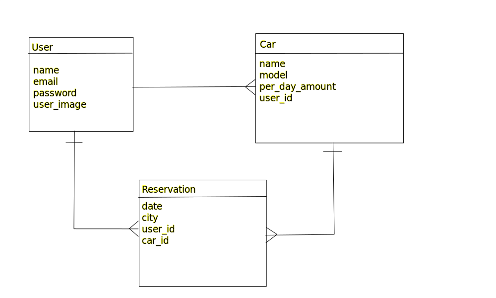

# Car Booking

Book Appointments backend is rails backend application for doctor book appoinemnts. This applications take works for API endpoints and users can load, create, and delete doctors and reservations. Users need to sign up or sign in to access the API endponits. They can sign up or sign in using the API endponts.

## Link to Front End
https://github.com/Kandy-Peter/car-booking-front-end

## Kanban Board
[Kanban Board Link](https://github.com/Kandy-Peter/car-booking-back-end/projects/1)


**We have finished this project with collaboration and team work. That's the reason we are able to finish it in this tight schedule.**

#### Total Members (3)
- Hammas Bin Saleem
- Farouq Daif
- Kandy Peter

## ER-Diagram



## Link Demo

[Cick here to get live demo]()

## Built With

- Ruby
- PostgreSQL
- Ruby on Rails

## `Getting Started`

To get a local copy of this project:

Clone this repository or download the Zip folder:
```
git clone git@github.com:Kandy-Peter/car-booking-back-end.git
```

Enter in root directory:
```
cd car-booking-back-end
```
Then run:
```
- bundle instal
```
Create Database (Mandatory)

```
rails db:create
rails db:schema:load
```

If you have made a migration the run this command

```
rails db:migrate
```

run ShareMe app on server:
```
rails s
```

Open Source code of car-booking-back-end app on VS-Code

```
code .
```
Run tests

```
rspec
```

## Authors

👤 **Hammas Bin Saleem**

- GitHub: [@HAMMAS-SALEEM](https://github.com/HAMMAS-SALEEM)
- Twitter: [@HammasSaleem4](https://twitter.com/HammasSaleem4)
- LinkedIn: [HAMMAS SALEEM](https://www.linkedin.com/in/hammas-saleem)

👤 **Kandi Peter**

- GitHub: [Kandi-Peter](https://github.com/Kandy-Peter)
- LinkedIn: [Kandi-Kamuntu](https://www.linkedin.com/in/kandi-peter-a49590212/)
- twitter: [Kandi_Peter](https://twitter.com/peter_kandy)

👤 **Farouq Daif**
- GitHub: [@farouqdaif1](https://github.com/farouqdaif1)
- LinkedIn: [@Farouq Daif ](https://www.linkedin.com/in/farouqdaif/)

## 🤝 Contributing

Contributions, issues, and feature requests are welcome!

Feel free to check the [issues page](https://github.com/Kandy-Peter/car-booking-back-end/issues).

## Show your support

Give a ⭐️ if you like this project!

## Acknowledgments

- Many thanks to Microverse whose documentation has been used.

## 📝 License

This project is [LICENSED](./LICENSE.md).
